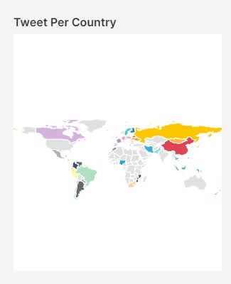
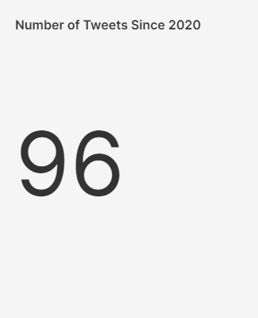
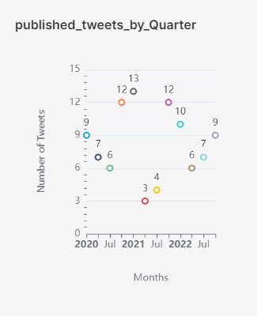
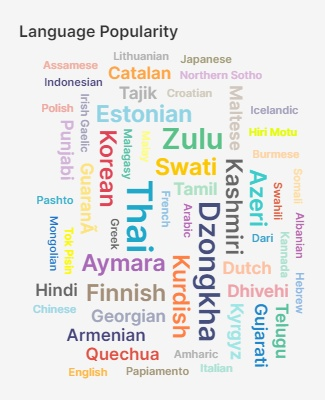
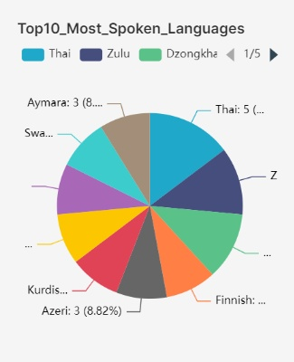

This is the Tweets section for the Twitter Health Surveillance (THS) Dashboards.

Here we have:

<h1>Tweets per Country</h1>
<embed src="http://136.145.77.77:8088/superset/dashboard/p/XkV9RXyBKmE/?standalone=true" width="100%" height="500px"/>

<h1>Number of Tweets since 2020</h1>
<embed src="http://136.145.77.77:8088/superset/dashboard/p/dXWBJgEnLMe/?standalone=true" width="100%" height="500px"/>

<h1>Published Tweets by Quarter</h1>
<embed src="http://136.145.77.77:8088/superset/dashboard/p/0lZn5gyOg76/?standalone=true" width="100%" height="500px"/>

<h1>Language Popularity</h1>
<embed src="http://136.145.77.77:8088/superset/dashboard/p/b83OeV5BQvR/?standalone=true" width="100%" height="500px"/>

<h1>Top 10 Most Spoken Languages</h1>
<embed src="http://136.145.77.77:8088/superset/dashboard/p/4o8BjZMBQ2G/?standalone=true" width="100%" height="500px"/>

