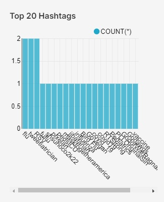
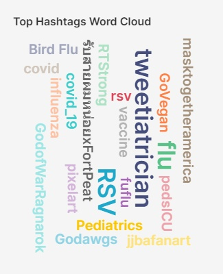

This is the Hashtags section for the Twitter Health Surveillance (THS) Dashboards.

Here we have:

<h1>Top 20 Hashtags (bar graph)</h1>
<embed src="http://136.145.77.77:8088/superset/dashboard/p/4zg9rVg9q0P/?standalone=true" width="100%" height="500px"/>

<h1>Top Hashtags (word cloud)</h1>
<embed src="http://136.145.77.77:8088/superset/dashboard/p/3PVnG5gOXvz/?standalone=true" width="100%" height="500px"/>

